## 1 引言

本报告基于当前代码仓库（Software-engineering-final-project-XianWai-AI-podcast）对系统设计、实现与测试内容进行更新，内容以“播客展示 + AI 分析 + 分段协作讨论”为核心，保留原有的文本转语音能力并在前端增加了多播客展示与正在浏览（深度视图）交互。后端采用 Flask + SQLAlchemy（SQLite）实现基本业务与数据持久化，TTS 功能通过可配置的 Baidu TTS 封装类支持。

报告在保持原有章节结构的前提下，重点补充当前项目中新增的“AI 聚焦 / 正在浏览”交互模块、主页推荐逻辑、分段时间线与讨论抽屉的实现细节。

---

## 2 系统设计

### 2.1 总体架构设计

弦外系统采用典型的 B/S（Browser/Server）三层架构：

- **表现层（前端）**：基于 HTML5 + CSS3 + JavaScript 实现，主要包括登录页面、注册页面和创作主页。通过 Ajax（`fetch`）与后端 REST 风格接口进行交互，实现无刷新体验。
- **业务逻辑层（后端）**：使用 Flask 框架构建 Web 应用，负责用户认证、会话管理、文本转语音调用、历史记录管理等核心业务逻辑。
- **数据持久层（数据库）**：选用 SQLite 作为轻量级关系型数据库，通过 SQLAlchemy ORM 进行数据访问和操作。
- **外部服务层**：接入百度云语音合成（Baidu TTS）服务，通过封装类 `BaiduTTS` 将文本转换为 MP3 音频文件。

整体结构示意为：

- 浏览器（前端页面）  
  ⬇⬆ HTTP / JSON  
- Flask 应用（路由 + 业务逻辑 + SQLAlchemy 模型）  
  ⬇⬆ SQL  
- SQLite 数据库（用户、音频历史记录）  
  ⬇  
- 百度 TTS 云服务（文本合成语音）

#### 2.1.1 系统总体流程图

为了更直观地展示用户从进入系统到完成文本转语音创作的端到端过程，系统主流程可表示为下图：

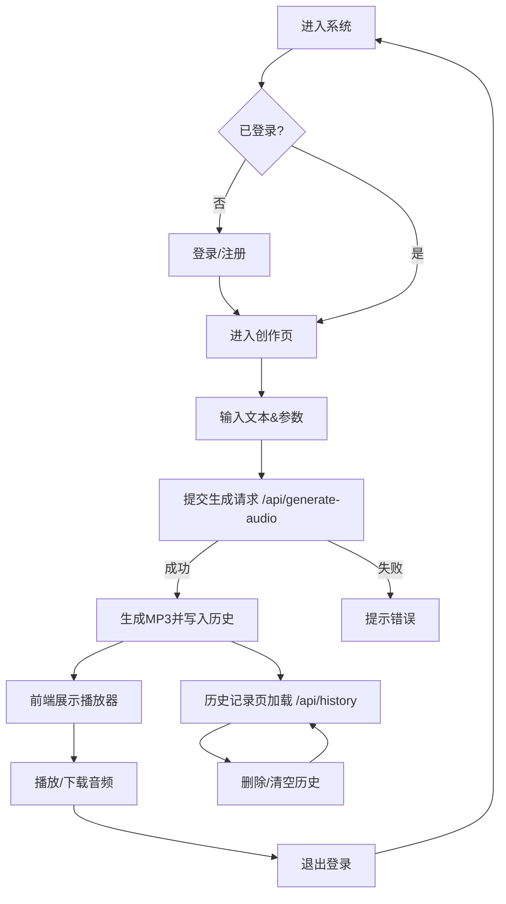

#### 2.1.2 系统 0 层数据流图（DFD）

从数据流角度看，弦外系统整体可抽象为若干处理过程和数据存储，0 层数据流图如下：

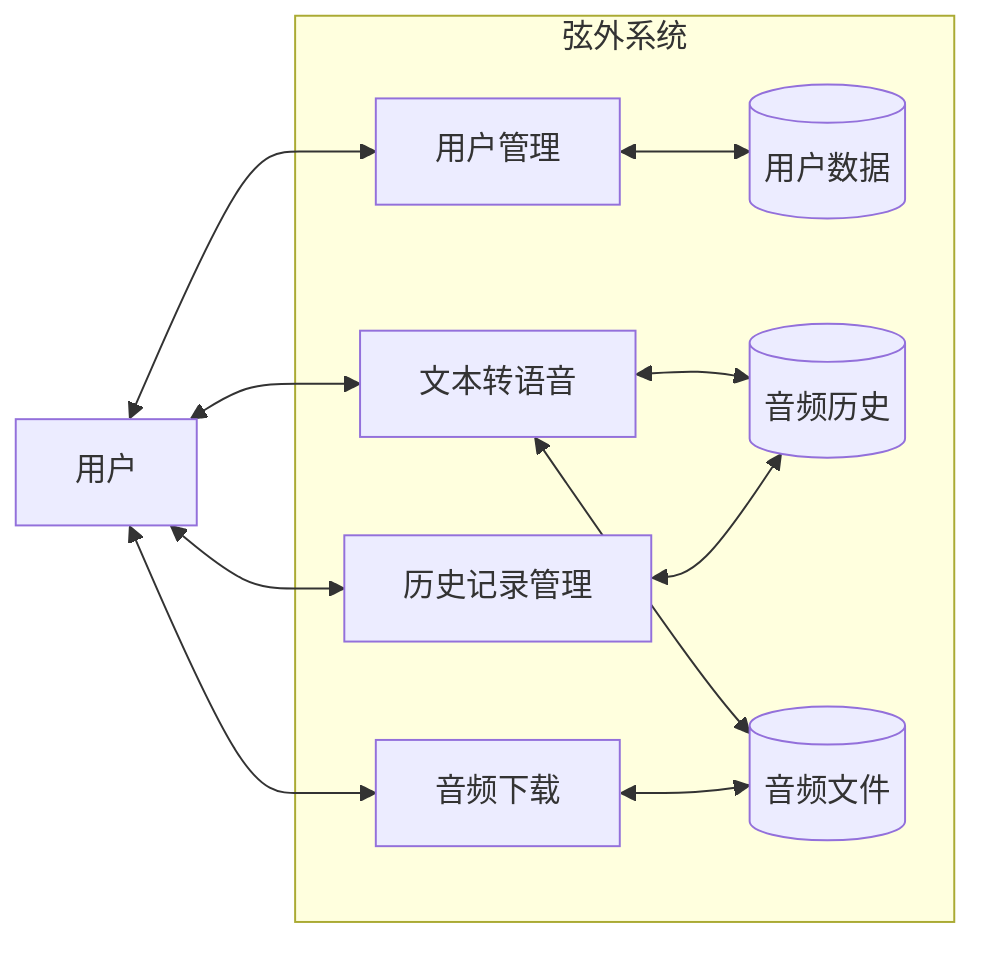

### 2.2 功能模块设计

系统主要功能模块包括（当前实现与扩展点）：

- **用户管理模块**  
  - 用户注册与登录：支持用户名/邮箱注册，密码哈希存储与登录会话管理（Flask Session）。  
  - 账户信息与设置：显示用户名、邮箱与默认 TTS 参数偏好。

- **播客浏览与推荐模块（Homepage）**  
  - 多播客卡片展示：首页随机/精选若干节目卡片，支持卡片级播放或加载到深度视图。  
  - 卡片样式与交互：网格卡片、hover 动效、快速播放按钮。  
  - 推荐逻辑：基于示例数据当前在前端实现；可扩展为后端行为驱动推荐。

- **正在浏览（Now）深度视图模块**  
  - Hero 区：封面、主标题、简介、元信息（主持/嘉宾/时长/播放/收藏等）。  
  - 播放器与分段时间轴：分段按时间排列，支持点击跳段（seek）并打开讨论抽屉。  
  - AI 主旨与要点：展示 AI 提炼的本期主题与关键信息（当前为前端示例数据，后端可替换）。  
  - 协同讨论区：抽屉式讨论窗口，允许针对某一分段发起讨论（前端内存示例，建议后端持久化）。

- **文本转语音模块（TTS）**  
  - 文本输入与参数校验（长度、编码与参数范围）。  
  - 后端调用封装的 `BaiduTTS`（或替代服务）生成 MP3，保存到 `uploads/`。  
  - 生成结果写入 `AudioHistory`，返回播放与下载 URL。

- **历史记录与文件管理模块**  
  - 历史记录查询（`/api/history`）、删除单条（`/api/history/<id>`）与清空功能。  
  - 删除历史时同步删除物理文件以节省存储。

- **行为收集与推荐扩展点**  
  - 前端记录用户交互（播放、点击分段、收藏），作为后端推荐或训练数据。  
  - 后端可维护 `UserBehavior` 表用于离线或在线推荐逻辑。

#### 2.2.1 系统功能结构图

从功能分解角度，系统可划分为若干一级与二级功能模块，结构关系如下：

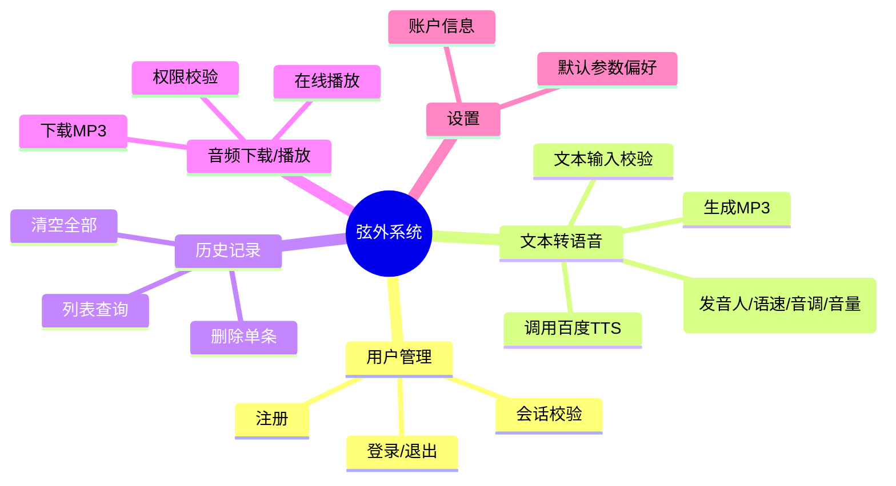

#### 2.2.2 音频生成状态图

以“文本转语音生成请求”为例，其生命周期状态变化如图所示：

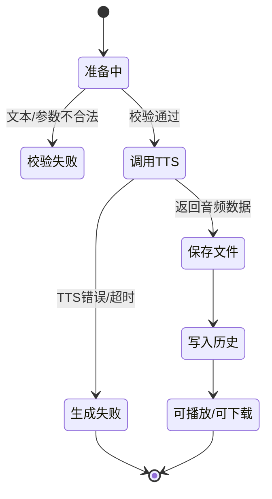

### 2.3 数据库设计

系统使用 SQLite 数据库，主要包含两张表：`User` 表和 `AudioHistory` 表。

- **User 表**（用户表）  
  - `id`：主键，自增整数。  
  - `username`：用户名，唯一且非空。  
  - `email`：邮箱地址，唯一且非空。  
  - `password_hash`：密码哈希值，使用 `werkzeug.security` 的 `generate_password_hash` 存储。  
  - `created_at`：账号创建时间。

- **AudioHistory 表**（音频历史记录表）  
  - `id`：主键，自增整数。  
  - `user_id`：外键，关联到 `User.id`。  
  - `text`：用于生成语音的原始文本。  
  - `filename`：生成的 MP3 文件名。  
  - `voice_id` / `voice_name`：发音人编号和名称。  
  - `speed` / `pitch` / `volume`：语速、音调、音量参数。  
  - `created_at`：生成时间。

`User` 与 `AudioHistory` 为一对多关系，通过 SQLAlchemy 的 `relationship` 建立逻辑关联，并开启 `cascade='all, delete-orphan'` 支持级联删除。

> 扩展建议：为支持当前项目的“分段 + 协同讨论 + 推荐”功能，建议在数据库层新增以下表或字段（当前实现为简化版，后续可迁移扩展）：

- `Podcast`：存储多档播客的元信息（title、description、cover、audio_url、duration、tags）。  
- `Segment`：记录每期节目的时间分段与焦点（podcast_id、start_time、end_time、title、focus、ai_summary）。  
- `Discussion`：分段讨论表（segment_id、user_id、content、created_at、parent_id），支持回复与层级。  
- `UserBehavior`：记录用户行为以供推荐（user_id、target_id、event_type、timestamp）。

上述扩展可以使系统把首页推荐、正在浏览的分段聚焦与推荐引擎的数据链路完整打通，便于实现垂直化推荐与行为分析。

#### 2.3.1 数据存储与外部服务图

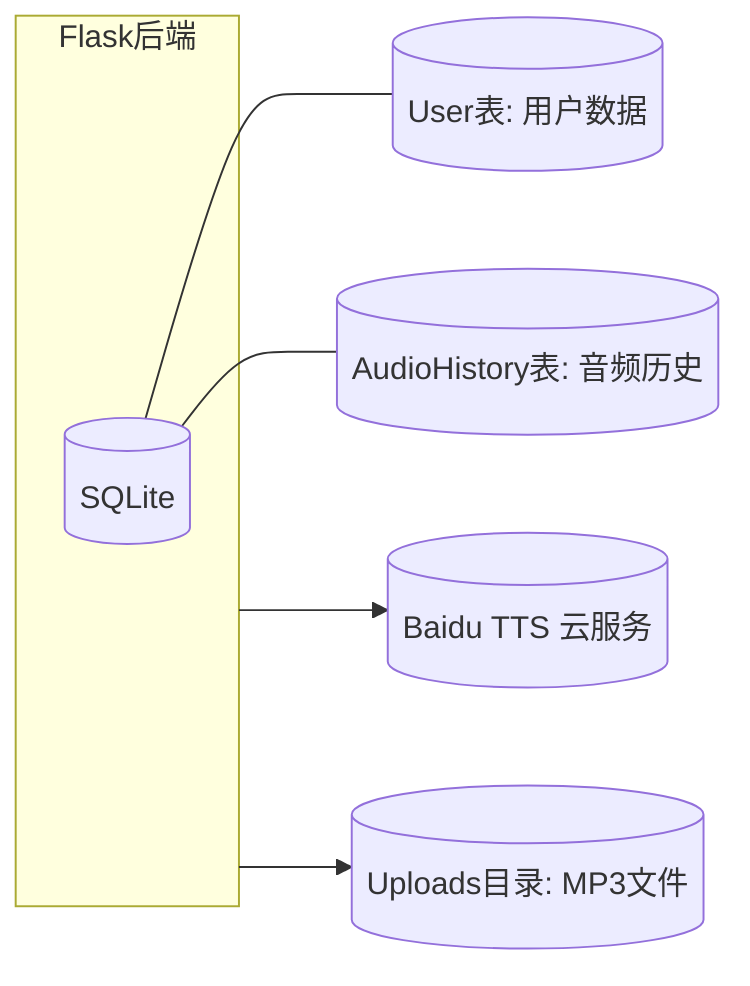

#### 2.3.2 文本转语音 1 层数据流图

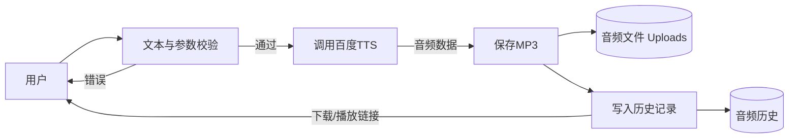

#### 2.3.3 类图（后端主要类/模型）

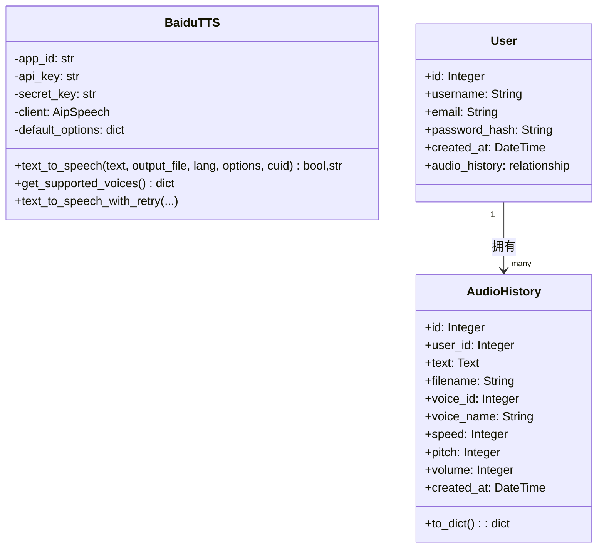

#### 2.3.4 数据库 ER 图（实体–联系）

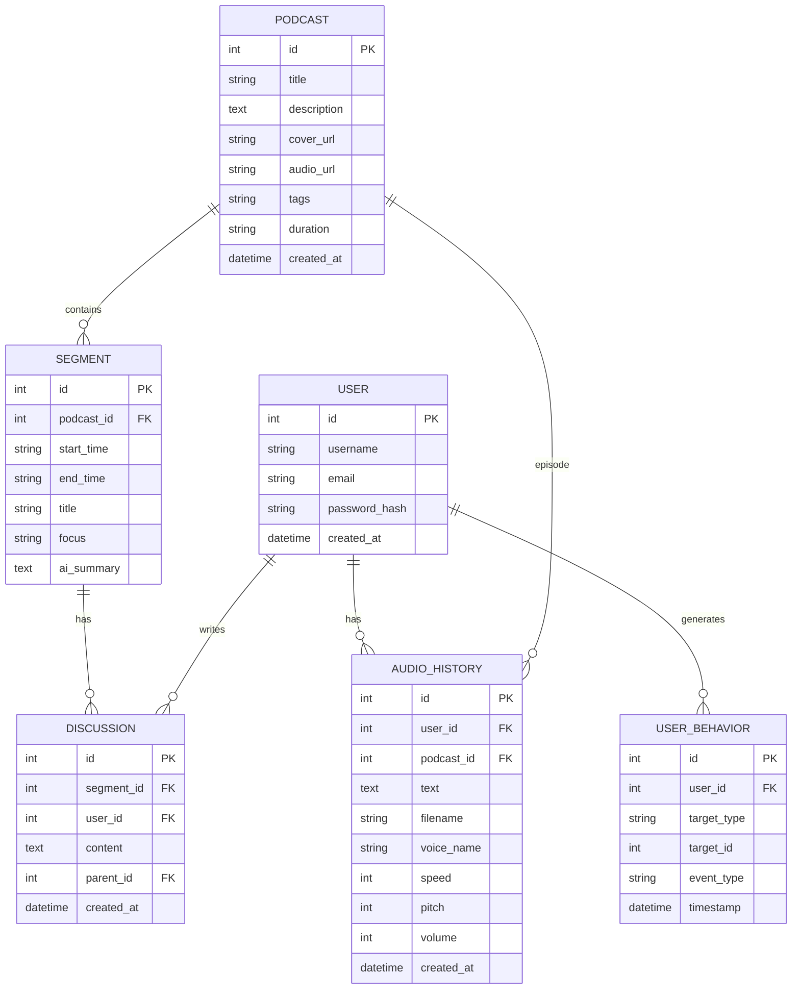

#### 2.3.5 SQLAlchemy 示例模型（扩展示例）

下面给出一组示例 SQLAlchemy 模型，供在项目中扩展使用。请在 `app.py` 中或单独 `models.py` 中引入并在应用上下文中创建表。

```python
from datetime import datetime
from flask_sqlalchemy import SQLAlchemy

db = SQLAlchemy()

class User(db.Model):
    id = db.Column(db.Integer, primary_key=True)
    username = db.Column(db.String(80), unique=True, nullable=False)
    email = db.Column(db.String(120), unique=True, nullable=False)
    password_hash = db.Column(db.String(255), nullable=False)
    created_at = db.Column(db.DateTime, default=datetime.utcnow)

    audio_history = db.relationship('AudioHistory', backref='user', lazy=True, cascade='all, delete-orphan')
    discussions = db.relationship('Discussion', backref='user', lazy=True)
    behaviors = db.relationship('UserBehavior', backref='user', lazy=True)

class Podcast(db.Model):
    id = db.Column(db.Integer, primary_key=True)
    title = db.Column(db.String(255), nullable=False)
    description = db.Column(db.Text)
    cover_url = db.Column(db.String(512))
    audio_url = db.Column(db.String(512))
    tags = db.Column(db.String(255))
    duration = db.Column(db.String(32))
    created_at = db.Column(db.DateTime, default=datetime.utcnow)

    segments = db.relationship('Segment', backref='podcast', lazy=True, cascade='all, delete-orphan')
    histories = db.relationship('AudioHistory', backref='podcast', lazy=True)

class Segment(db.Model):
    id = db.Column(db.Integer, primary_key=True)
    podcast_id = db.Column(db.Integer, db.ForeignKey('podcast.id'), nullable=False)
    start_time = db.Column(db.String(16), nullable=False)
    end_time = db.Column(db.String(16))
    title = db.Column(db.String(255))
    focus = db.Column(db.String(255))
    ai_summary = db.Column(db.Text)

    discussions = db.relationship('Discussion', backref='segment', lazy=True, cascade='all, delete-orphan')

class AudioHistory(db.Model):
    id = db.Column(db.Integer, primary_key=True)
    user_id = db.Column(db.Integer, db.ForeignKey('user.id'), nullable=False)
    podcast_id = db.Column(db.Integer, db.ForeignKey('podcast.id'))
    text = db.Column(db.Text)
    filename = db.Column(db.String(255))
    voice_name = db.Column(db.String(100))
    speed = db.Column(db.Integer, default=5)
    pitch = db.Column(db.Integer, default=5)
    volume = db.Column(db.Integer, default=5)
    created_at = db.Column(db.DateTime, default=datetime.utcnow)

class Discussion(db.Model):
    id = db.Column(db.Integer, primary_key=True)
    segment_id = db.Column(db.Integer, db.ForeignKey('segment.id'), nullable=False)
    user_id = db.Column(db.Integer, db.ForeignKey('user.id'), nullable=False)
    content = db.Column(db.Text, nullable=False)
    parent_id = db.Column(db.Integer, db.ForeignKey('discussion.id'), nullable=True)
    created_at = db.Column(db.DateTime, default=datetime.utcnow)

    replies = db.relationship('Discussion', backref=db.backref('parent', remote_side=[id]), lazy=True)

class UserBehavior(db.Model):
    id = db.Column(db.Integer, primary_key=True)
    user_id = db.Column(db.Integer, db.ForeignKey('user.id'), nullable=False)
    target_type = db.Column(db.String(64))  # e.g., 'podcast' or 'segment'
    target_id = db.Column(db.Integer)
    event_type = db.Column(db.String(64))   # e.g., 'play', 'like', 'focus'
    timestamp = db.Column(db.DateTime, default=datetime.utcnow)
```

---

## 3 系统设计实现—系统实现

本章重点介绍弦外系统的具体实现过程，包括开发环境配置、核心后端实现、前端界面与交互实现、TTS 封装与调用、以及文件与安全管理等方面。

### 3.1 开发环境与技术选型

- **开发语言**：Python 3.x、JavaScript（ES6）。  
- **后端框架**：Flask（轻量级 Web 框架，便于快速开发和部署）。  
- **ORM 与数据库**：Flask‑SQLAlchemy + SQLite。  
- **前端技术栈**：原生 HTML5 + CSS3 + JavaScript，配合自定义样式与交互脚本（`main.css` / `auth.css`、`main.js` / `auth.js`）。  
- **第三方服务**：百度 AI 平台提供的语音合成 SDK（`aip` 包）。  
- **运行与依赖管理**：通过 `requirements.txt` 管理依赖包，使用本地虚拟环境或全局环境运行 Flask 应用。

在系统启动时，Flask 应用会自动创建数据库表结构，并确保音频上传目录 `uploads` 存在，为后续音频文件生成和访问提供基础设施。

### 3.2 后端实现

#### 3.2.1 Flask 应用配置

后端入口文件为 `app.py`，核心配置包括：

- 设置 `SECRET_KEY` 用于 Session 加密，防止会话被伪造。  
- 配置 `SQLALCHEMY_DATABASE_URI = 'sqlite:///xianwai.db'`，指定使用本地 SQLite 数据库。  
- 关闭 `SQLALCHEMY_TRACK_MODIFICATIONS` 以减少开销和警告。  
- 配置 `UPLOAD_FOLDER = 'uploads'`，设置最大上传内容大小 `MAX_CONTENT_LENGTH = 16 * 1024 * 1024`。  
- 使用 `os.makedirs(app.config['UPLOAD_FOLDER'], exist_ok=True)` 确保音频文件目录存在。  
- 从环境变量中读取百度 TTS 的 `APP_ID`、`API_KEY` 和 `SECRET_KEY`，用于初始化 `BaiduTTS` 客户端。

通过 `with app.app_context(): db.create_all()` 在应用启动时创建数据库表，保证系统首次运行即可使用。

#### 3.2.2 数据模型实现

系统通过 SQLAlchemy 定义 `User` 和 `AudioHistory` 两个模型类：

- `User` 模型包含用户名、邮箱、密码哈希和创建时间字段，并通过 `audio_history = db.relationship('AudioHistory', ...)` 与历史记录建立关系。  
- `AudioHistory` 模型中实现了 `to_dict` 方法，将对象转换为 JSON 可序列化的字典结构，方便 REST 接口直接返回给前端使用。

此设计简化了数据访问代码，提高了可维护性，同时为后续扩展（如增加更多用户属性或音频元数据）提供了空间。

#### 3.2.3 用户注册与登录实现

**（1）注册功能实现 `/register`**

- GET 请求返回注册页面模板 `register.html`。  
- POST 请求接收前端以 JSON 格式提交的注册数据，包括 `username`、`email`、`password`、`confirm_password`。  
- 后端对输入进行多重校验：  
  - 非空校验（所有字段不能为空）；  
  - 用户名长度限制（3–20 个字符）；  
  - 密码长度限制（至少 6 个字符）；  
  - 两次密码一致性校验；  
  - 用户名和邮箱唯一性检查。  
- 通过 `generate_password_hash` 对密码进行加密存储，防止明文密码泄露。  
- 注册成功后，自动将用户信息写入 Session，保持登录状态，并返回 JSON 结果给前端。

**（2）登录功能实现 `/login`**

- GET 请求：若已登录（Session 中存在 `user_id`），则重定向至 `/home`，否则渲染登录页面 `login.html`。  
- POST 请求：接收前端发送的 JSON，包括 `username`（可为用户名或邮箱）和 `password`。  
- 后端根据用户名或邮箱查询用户，并使用 `check_password_hash` 校验密码。  
- 登录成功后，在 Session 中保存 `user_id` 和 `username`，并返回 `success: True` 的 JSON 响应。  
- 登录失败时返回相应错误消息与 HTTP 状态码（401 或 400/500），支持前端做出友好提示。

**（3）会话与登出实现 `/logout`**

- 登出接口通过 `session.clear()` 清空当前会话，保证用户安全退出。  
- 操作完成后重定向至登录页，前端导航栏也提供“退出登录”按钮，调用该接口实现一键退出。

#### 3.2.4 文本转语音接口实现

核心接口 `/api/generate-audio` 负责将前端提交的文本转换为音频文件，并保存生成记录：

1. **登录校验**：若 Session 中不存在 `user_id`，则返回未登录错误（HTTP 401）。  
2. **TTS 客户端校验**：若百度 TTS 未正确配置，则返回服务未配置的错误提示。  
3. **参数解析与校验**：  
   - 从 JSON 请求体中读取 `text`、`voice`、`speed`、`pitch`、`volume` 等参数；  
   - 去除文本首尾空格并进行非空校验；  
   - 使用 `len(text.encode('gbk'))` 计算字节长度，保证不超过百度 TTS 的 1024 字节上限。  
4. **文件名与路径生成**：  
   - 使用 `uuid.uuid4().hex` 生成全局唯一文件名，避免冲突；  
   - 通过 `os.path.join(UPLOAD_FOLDER, filename)` 生成完整文件路径。  
5. **TTS 参数封装与调用**：  
   - 调用 `tts_client.get_supported_voices()` 获取发音人名称；  
   - 构建 `options = {'spd': speed, 'pit': pitch, 'vol': volume, 'per': voice}` 传递给 TTS；  
   - 调用 `tts_client.text_to_speech(text, output_file=filepath, options=options, cuid=f'user_{session["user_id"]}')` 生成音频。  
6. **结果处理与历史记录保存**：  
   - 若合成成功，则创建 `AudioHistory` 记录（包含文本、文件名、参数配置），并提交到数据库；  
   - 将 `audio_url`（指向 `/api/audio/<filename>` 的下载地址）返回给前端；  
   - 若失败，则返回错误信息和 500 状态码。

通过上述流程，系统实现了一个完整、可配置的文本转语音服务端接口。

#### 3.2.5 音频文件下载与历史记录接口实现

**（1）音频下载 `/api/audio/<filename>`**

- 先校验用户是否登录。  
- 再根据 `filename` 和当前用户 `user_id` 在 `AudioHistory` 中进行查询，确保用户仅能访问属于自己的音频文件。  
- 若校验通过，使用 `send_from_directory` 从 `uploads` 目录中返回对应文件，并启用 `as_attachment=True` 以下载形式提供。

**（2）历史记录接口 `/api/history`**

- GET：查询当前用户最近 50 条历史记录，按 `created_at` 倒序排序，通过 `to_dict` 序列化为列表返回。  
- POST：目前为兼容接口，前端生成时已自动保存，返回简单成功消息。  
- DELETE：清空当前用户所有历史记录，同时删除数据库记录，出现异常时回滚事务并返回错误信息。

**（3）单条历史删除 `/api/history/<int:history_id>`**

- 根据 `history_id` 和当前 `user_id` 查询记录，找不到则返回 404。  
- 找到后先删除对应音频文件，再删除数据库记录，并提交事务。  
- 若中途出错，通过 `db.session.rollback()` 回滚，保证数据库和文件系统的一致性。

#### 3.2.6 用户信息查询接口

接口 `/api/user/info` 用于在设置页中展示当前用户信息：

- 检查 Session 中是否存在 `user_id`，未登录返回 401。  
- 从数据库中查询用户对象，存在时返回 `id`、`username`、`email`、`created_at` 等信息。  
- 前端设置页通过该接口填充“账户信息”区域。

### 3.3 前端实现

前端部分主要由三个模板页面和对应的样式、脚本文件组成：

- `login.html`：登录页面。  
- `register.html`：注册页面。  
- `home.html`：主工作台页面（创作、历史记录、设置）。

#### 3.3.1 登录与注册页面

- 使用统一的 `auth.css` 实现整体视觉风格，包括背景波浪动画、卡片式登录框、按钮动效等。  
- 在 `auth.js` 中通过 JavaScript 绑定表单提交事件，使用 `fetch` 向后端 `/login` 与 `/register` 发送 JSON 请求：  
  - 在前端进行基础输入校验并显示错误提示；  
  - 请求过程中显示按钮加载动画；  
  - 根据后端返回结果弹出提示（成功/失败），成功后跳转到 `/home` 或 `/login`。  
- 密码输入框支持“显示/隐藏密码”切换，提升用户体验。

#### 3.3.2 创作页面与音频播放

`home.html` 是系统的核心工作页面，实现了三个主要 Tab：

- **创作 Tab**：  
  - 左侧为文本输入区域和语音参数设置：文本框实时统计字数，并在超过限制前提醒用户；  
  - 语速、音调、音量使用滑块控件展示，当前值通过旁边数字即时显示；  
  - “生成语音”按钮点击后调用 `/api/generate-audio`，并在生成期间显示加载遮罩层。  

- **音频预览区域**：  
  - 若尚未生成音频，显示“空状态”提示；  
  - 生成成功后，动态创建 `<audio>` 播放器，支持播放与暂停；  
  - 提供“下载”按钮触发 `/api/audio/<filename>` 接口下载音频。  

- **历史记录 Tab**：  
  - 通过 `/api/history` 接口加载当前用户的历史记录列表；  
  - 每条记录展示生成时间、部分文本内容、参数摘要等信息，并提供播放、下载和删除操作按钮；  
  - “清空历史”按钮调用 `DELETE /api/history` 一次性删除所有历史记录。

- **设置 Tab**：  
  - 通过 `/api/user/info` 获取并展示当前用户的用户名和邮箱；  
  - 支持设置默认发音人等偏好（可在后续版本扩展持久化保存）；  
  - 提供“退出登录”按钮调用 `/logout`。

前端脚本 `main.js` 负责：

- 绑定 Tab 切换逻辑；  
- 监听文本输入框实时更新字数统计；  
- 封装统一的消息提示组件（Toast）；  
- 对所有网络请求统一处理加载状态和错误提示。

### 3.4 TTS 封装与调用实现

文件 `AI_Text_to_Audio.py` 中实现了对百度 TTS 的二次封装 `BaiduTTS` 类：

- 在构造函数中初始化 `AipSpeech` 客户端，并保存默认语音参数（音量、语速、音调、发音人）。  
- 在 `text_to_speech` 方法中：  
  - 首先检查文本字节长度是否超过 1024，若超限直接返回错误；  
  - 合并默认参数与自定义参数，添加 `cuid` 标识；  
  - 调用 `client.synthesis` 接口进行语音合成，并判断返回结果类型：  
    - 若为字典，则表示出现错误，提取 `err_msg` 和 `err_no` 返回；  
    - 若为二进制数据，则写入指定 MP3 文件路径。  
- 提供 `get_supported_voices` 方法，统一维护系统支持的发音人列表，便于前端展示。  
- 提供带重试机制的 `text_to_speech_with_retry` 方法，在出现服务器繁忙或访问频率受限等可重试错误时自动多次尝试。

通过将百度 TTS 相关逻辑集中封装，后端业务代码只需关注“传入文本与参数、获取文件路径和错误信息”，提高了代码的清晰度和可维护性。

### 3.5 文件与安全管理

在系统实现过程中，还针对安全性做了以下考虑：

- **会话安全**：通过 `SECRET_KEY` 保护 Session，避免会话被伪造；所有需要登录的接口在进入逻辑前统一判断 Session。  
- **访问控制**：音频下载和历史记录相关接口均校验 `user_id`，防止跨用户访问他人音频文件或记录。  
- **输入校验**：对登录、注册、文本转语音输入进行严格校验，避免异常输入导致系统崩溃或逻辑错误。  
- **错误处理与事务管理**：对数据库写操作使用 `try/except` 包裹，出现异常时调用 `db.session.rollback()` 回滚事务，并返回清晰的错误信息给前端。

---

## 核心运转逻辑（当前项目实现）

本节集中说明项目的“播客 + 嵌入式 AI + 分段讨论 + 行为驱动推荐”核心运转逻辑。说明内容严格基于当前仓库实现（前端：`templates/home.html`、`static/js/main.js`、`static/css/main.css`；后端：`app.py`；模型扩展已建议在前文），并补充 AI 聚焦、交互序列、数据流与推荐管道的示意图与伪代码示例。

概览步骤：

1) 播客展示与上传（前端/后端）  
   - 用户或作者上传整期音频（或使用 TTS 生成示例音频），后端保存为 `uploads/<filename>`，并在 `Podcast` / `AudioHistory` 写入元数据。  
2) 自动化 AI 分析（后端/离线或实时）  
   - 系统对每期音频执行两类分析：一是“主题主旨分析”（整期摘要与主题标签），二是“核心内容拆解与分段”（Segment 划分与每段要点、AI 摘要）。分析结果写入 `Segment.ai_summary` 与 `Podcast` 的 `tags` / `description`。  
3) 用户交互（前端）  
   - 用户在首页浏览卡片，点击某期进入“正在浏览”视图。默认显示该期的 AI 主旨、分段时间轴与协同讨论入口。用户点击任一分段时，前端会把该段信息作为“当前 AI 注意力上下文”发送给后端或直接传入前端嵌入的 AI 服务，以便 AI 在当前上下文下回答问题或生成延伸内容。  
4) 行为收集与推荐（后端/离线）  
   - 系统记录用户行为（播放、点击分段、关注作者/主题、收藏等）写入 `UserBehavior`。定时或在线训练推荐模型，输出“垂直扩展的内容推荐”并在首页或播放结束后推送给用户。

### 3.6 序列图：用户聚焦某分段并与 AI / 用户讨论（实时交互流程）

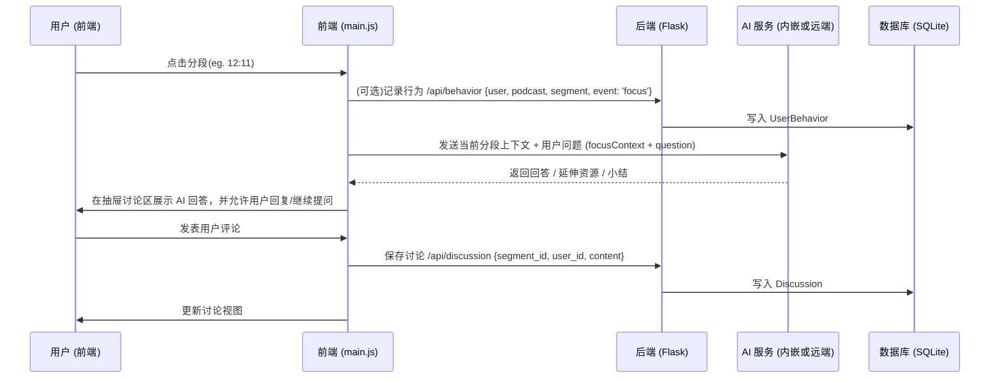

说明：AI 可以是后端服务（调用 OpenAI / 本地 LLM）或浏览器端的轻量模型；当前代码以前端示例数据模拟 AI 回答流程，后端接口可扩展为 `/api/ai/respond` 等。

### 3.7 数据流图：AI 分析与推荐数据流水线

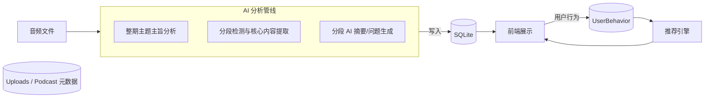

说明：AnalysisPipeline 可以采用异步任务（如 Celery / 后台作业）或实时调用，取决于规模与延迟要求。当前实现为示例同步流程或前端示例数据；生产环境建议把分析任务放到后台并异步写入 `Segment.ai_summary`。

### 3.8 API 设计（与当前实现对照）

- GET `/home`：渲染首页（前端从内置 `browseItems` 获取示例卡，或从后端 `/api/podcasts` 获取真实列表）。  
- GET `/podcast/<id>`：渲染单期深度页（Now view），或前端通过 `/api/podcast/<id>` 拉取 JSON 元数据（包括 segments 与 ai_summary）。  
- POST `/api/generate-audio`：当前实现的 TTS 接口（文本到 MP3）。  
- POST `/api/behavior`：记录用户行为（event_type: play/focus/like/collect，target_id 可为 podcast/segment）。  
- POST `/api/discussion`：保存讨论到数据库（segment_id, user_id, content）。  
- POST `/api/ai/respond`（建议）：接受 {segment_id, context, query}，返回 AI 回答与延伸资源。

### 3.9 前端实现要点（当前仓库）

- `renderNowNav()`：渲染正在浏览的 Hero、时间线与播放按钮。时间线点击触发 `seekAudio(start)` 并 `openDrawer(segmentId)`。  
- `renderBrowse()`：渲染首页卡片（随机选择，不包含当前 hero）。  
- `openDrawer(segmentId)`：抽屉讨论打开并加载 `podcast.discussions`（当前为前端内存示例，可改为 `/api/discussion?segment_id=` 请求）。  
- 推荐可以通过 `/api/behavior` 把播放/焦点等事件发送到后端，后端离线或实时计算推荐结果。

### 3.10 AI 聚焦（示例伪代码）

前端在用户聚焦某段时，将该段作为 AI 的“上下文窗口”传给 AI 服务（后端或直接前端调用），示例伪代码如下（后端接入示例）：

```python
# Flask 后端伪代码：/api/ai/respond
@app.route('/api/ai/respond', methods=['POST'])
def ai_respond():
    data = request.get_json()
    segment_id = data.get('segment_id')
    question = data.get('question')
    # 从 DB 读取段落文本或 ai_summary
    seg = Segment.query.get(segment_id)
    context = seg.ai_summary or get_transcript_for_segment(seg)
    # 调用 LLM 服务（同步或异步）
    answer = call_llm(prompt=f"上下文：{context}\n问题：{question}")
    return jsonify({'success': True, 'answer': answer})
```

前端发送聚焦请求示例（简化）：

```javascript
async function askAiOnSegment(segmentId, question) {
  const res = await fetch('/api/ai/respond', {
    method: 'POST',
    headers: {'Content-Type':'application/json'},
    body: JSON.stringify({segment_id: segmentId, question})
  });
  const data = await res.json();
  return data.answer;
}
```

注：若希望将 AI 模型的上下文扩展为多段或整期，请在后端拼接适当的上下文（注意 token 限制）。

### 3.11 推荐管道（高层）

行为 → 数据收集（UserBehavior）→ 离线/实时特征工程 → 推荐模型（规则/协同过滤/基于内容或混合模型）→ 推荐结果写入缓存 → 前端轮询或推送更新。

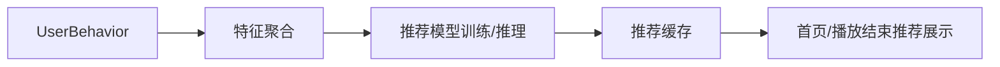

---

（核心运转逻辑章节完成）

## 4 系统测试

### 4.1 测试环境

- **硬件环境**：普通 PC / 笔记本电脑。  
- **操作系统**：Windows 10。  
- **运行环境**：Python 3.x，已安装 `Flask`、`Flask‑SQLAlchemy`、`aip` 等依赖包。  
- **浏览器环境**：Chrome / Edge 等现代浏览器。

### 4.2 测试类型与方法

系统主要进行了以下几类测试：

- **单元测试（逻辑级）**  
  - 对 `BaiduTTS` 类的文本长度校验、错误返回等进行验证。  
  - 对用户注册输入校验逻辑进行模拟测试，确保边界条件处理正确。

- **接口测试（API 级）**  
  - 使用 Postman 或浏览器开发者工具，对 `/login`、`/register`、`/api/generate-audio`、`/api/history`、`/api/audio/<filename>` 等接口进行请求与响应验证。  
  - 检查 HTTP 状态码、返回 JSON 字段是否符合预期。

- **功能测试（端到端）**  
  - 从“注册新用户 → 登录 → 文本输入 → 生成语音 → 播放与下载 → 查看与删除历史记录 → 退出登录”的完整流程进行走查。  
  - 测试不同参数组合对生成语音的影响（发音人、语速、音调、音量）。

- **异常与边界测试**  
  - 输入空文本或超长文本，检查系统是否能给出明确错误提示；  
  - 使用错误密码登录、使用已注册邮箱再次注册等情况；  
  - 删除不存在或不属于当前用户的历史记录，确认接口能安全拒绝操作。

### 4.3 典型测试用例

以下列出若干典型测试用例（节选）：

- **用例 1：正常注册**  
  - 前置条件：用户名和邮箱未被使用。  
  - 输入：合法用户名、邮箱、两次一致的密码。  
  - 期望结果：返回 `success: True`，页面提示“注册成功”，自动登录并跳转至主页。

- **用例 2：重复邮箱注册**  
  - 前置条件：邮箱已注册。  
  - 输入：新的用户名、已存在的邮箱。  
  - 期望结果：返回 `success: False`，错误消息“邮箱已被注册”，不创建新用户。

- **用例 3：文本转语音（正常）**  
  - 前置条件：已登录，百度 TTS 配置正确。  
  - 输入：长度小于 1024 字节的中文文本，发音人 0，语速 5，音调 5，音量 5。  
  - 期望结果：返回 `success: True`，生成 MP3 文件，可在前端页面正常播放和下载，同时历史记录中新增一条记录。

- **用例 4：文本过长**  
  - 输入：长度超过 1024 字节的中文文本。  
  - 期望结果：返回 `success: False`，错误信息“文本长度超过1024字节限制”，不生成音频文件。

- **用例 5：历史记录删除**  
  - 操作：在历史记录页面删除一条指定记录。  
  - 期望结果：前端列表中该记录消失，对应音频文件从 `uploads` 目录删除，刷新页面后记录不再出现。

### 4.4 测试结果分析

通过上述测试，系统在以下方面表现良好：

- 用户注册、登录、登出流程稳定，错误提示明确；  
- 文本转语音功能在百度 TTS 正常可用的前提下，能稳定生成音频文件，参数生效正常；  
- 历史记录的新增、查询、删除、清空操作逻辑正确，数据与文件状态保持一致；  
- 前端界面交互流畅，错误情况能通过弹窗或提示条友好展示给用户。

仍可改进的方向包括：

- 增加更完善的自动化测试脚本，覆盖更多异常场景；  
- 对网络异常和第三方服务限流情况增加更细致的降级策略和提示信息。

---

## 5 总结

弦外（Xian Wai）系统通过 Flask + SQLite + 百度 TTS 的技术组合，实现了一个集“文本转语音、音频管理、用户管理”于一体的智能播客创作平台。系统采用清晰的分层架构和模块化设计，前后端职责划分明确，具备良好的可维护性和可扩展性。

在实现过程中，重点解决了文本长度限制、音频文件管理、用户权限控制以及与第三方 TTS 服务的集成等问题。通过系统性测试，验证了主要功能模块的正确性与稳定性，为后续在更大规模数据、更多发音人和更复杂业务场景下的扩展打下了良好基础。


